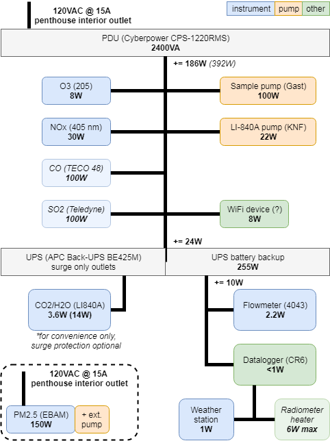
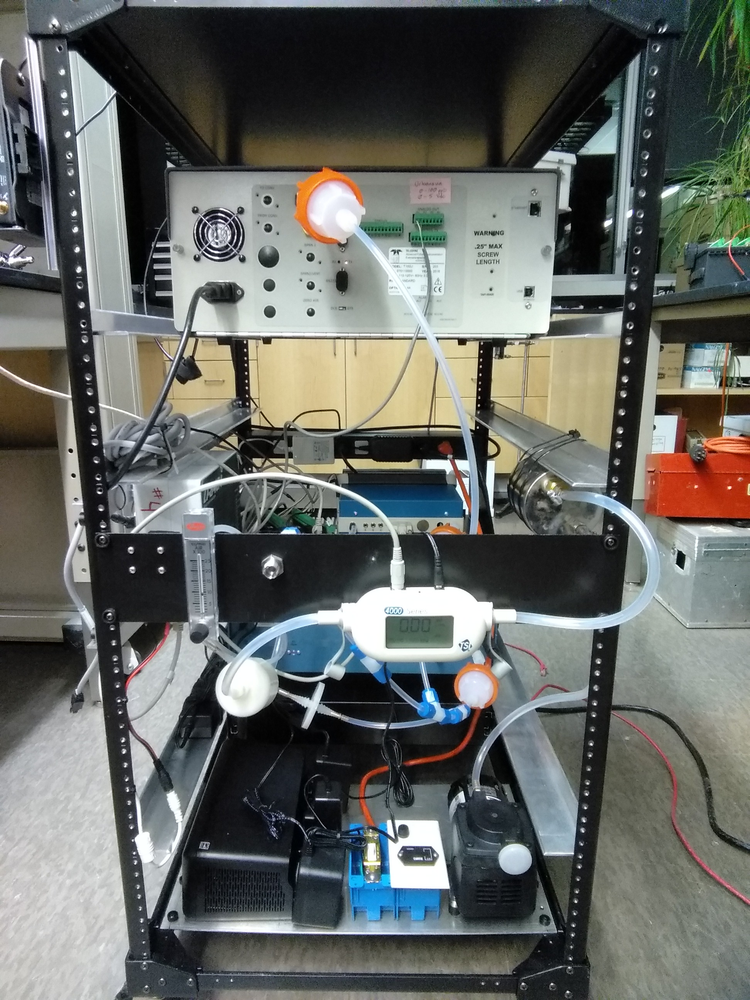
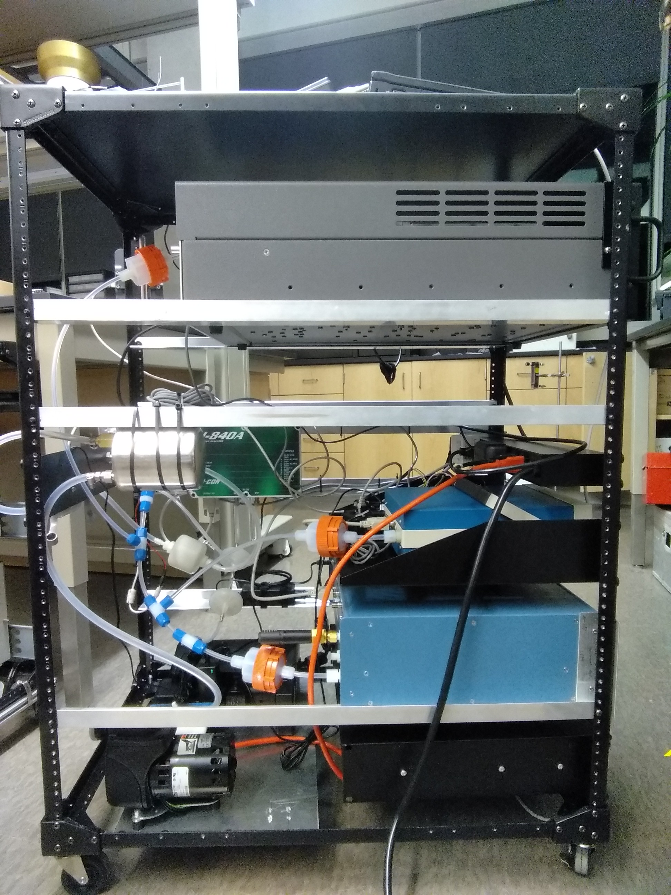
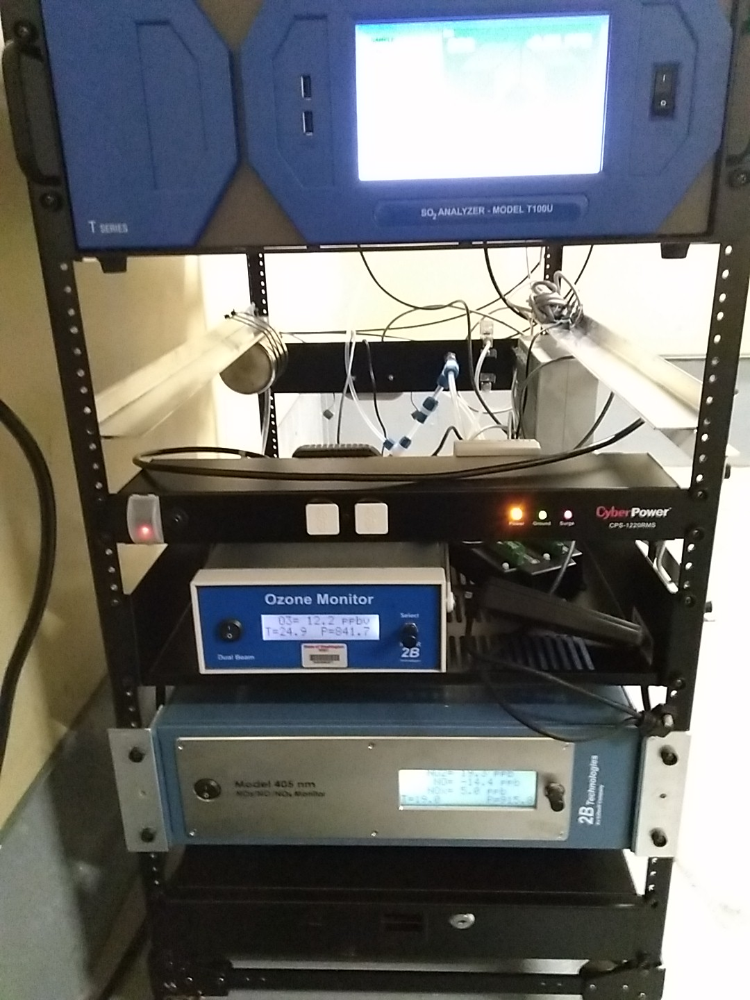

# Documentation

### Urbanova Air Quality Reference Site

*Table of Contents*

* [Instrumentation Summary](#instrumentation)
* [Datalogger Program Usage](#datalogger-program-usage)
* [Sampling Details](#sampling-details)

## Instrumentation

### Current Deployment

The following scientific instruments and meteorological sensors are deployed
at this location:

* Total weather station ([MaxiMet GMX600; Gill Instruments](http://gillinstruments.com/products/anemometer/maximet-compact-weather-stations.html))
    * Air temperature
    * Barometric pressure
    * Relative/absolute humidity
    * Precipitation (optical)
    * Average/gust wind speed
    * True/apparent wind direction
    * Location/orientation data (GPS)
* Ambient aerosol monitor ([E-BAM PLUS; Met One Instruments](http://metone.com/air-quality-particulate-monitors/regulatory-2__trashed/e-bam/))
    * Fine particulate matter (PM2.5)
* Closed-path gas analyzer ([LI-840A; LICOR Biosciences](https://www.licor.com/env/products/gas_analysis/LI-840A/))
    * Carbon dioxide (CO2)
    * Water vapor (absolute humidity)
* Closed-path gas analyzer ([Model 205; 2B Technologies](http://twobtech.com/model-205-ozone-monitor.html))
    * Ozone (O3)
* Closed-path gas analyzer ([Model 405 nm; 2B Technologies](http://twobtech.com/model-405-nm-nox-monitor.html))
    * Nitric oxide (NO)
    * Nitrogen dioxide (NO2)
    * Other oxides of nitrogen (NOX)
* Mass flowmeter ([Model 4043; TSI](http://www.tsi.com/Mass-Flowmeter-4043/))
    * Volumetric/mass flow rate
    * Gas stream temperature
    * Gas stream pressure
* Datalogger ([CR6; Campbell Scientific](https://www.campbellsci.com/cr6))
    * with keyboard display

### Future Work

Additionally, the following are anticipate for future inclusion:

* Closed-path gas analyzer (Model 48; Thermo Environ Corp)
    * Carbon monoxide
* 4-channel component net radiometer ([CNR1; Kipp & Zonen](https://www.campbellsci.com/cnr1))
    * long wave & short wave, incoming & outgoing radiation
* photosynthetically active radiation (PAR) ([LI-190SB; LICOR Biosciences](https://www.campbellsci.com/li190sb-l))
    * PAR

## Datalogger Program Usage

The following user-editable settings are exposed via the *Public* data table
or the physical keyboard display:

* Calibration scaling coefficients for gas analyzers

### Modifying program settings

To update values:

1. Select the desired setting to modify
2. Press <kbd>Enter</kbd> (keyboard display) or double-click (LoggerNe Clients)
   to enable value editing
3. Input the new desired value in the appropriate field
4. Repeat for each setting

Changes are **not** effective until you explicitly save:

* Keyboard display: <kbd>Settings</kbd>&rarr;<kbd>Apply/cancel</kbd>&rarr;
  <kbd>Save now?</kbd>&rarr;<kbd>Yes</kbd>
* LoggerNet clients: while viewing the *Public* table, type `true` into the
  field `save_changes`, then wait several seconds (the value will revert to 
  `false` once changes are saved)

To discard all changes made to settings and revert values to their last 
selection, at any time:

* Keyboard display: <kbd>Settings</kbd>&rarr;<kbd>Apply/cancel</kbd>&rarr;
  <kbd>Discard?</kbd>&rarr;<kbd>Yes</kbd>
* LoggerNet clients: while viewing the *Public* table, type `true` into the
  field `discard_changes`, then wait several seconds (the value will revert to
  `false` once changes are discarded)

To reset all settings to their default values, at any time:

* Keyboard display: <kbd>Settings</kbd>&rarr;<kbd>Apply/cancel</kbd>&rarr;
  <kbd>To defaults?</kbd>&rarr;<kbd>Yes</kbd>
* LoggerNet clients: while viewing the *Public* table, type `true` into the
  field `set_defaults`, then wait several seconds (the value will revert to
  `false` once defaults are applied)

----

## Sampling Details

### Plumbing

Trace gas analyzers and supporting hardware (including logger and pumps) are
installed in a portable 19" rack. A 50ft length of 3/8" O.D. PFA tube (*Swagelok
PFA-T6-062-xx*) extends from the rack to a tripod situated outside the penthouse
and a diaphragm pump (*Gast p/n 22D1180-201-1003*) draws outside air past the gas
analyzer inlets at roughly 15-20 SLPM. A flow meter (*TSI 4043*) sits downstream
of the trace gas analyzers, ahead of the pump, for monitoring total sample flow, 
temperature and pressure. The flowmeter and pump are protected from particles
by the filter provided with the flowmeter. An open-faced PFA membrane filter 
holder (no filter installed) (*Savillex 401-series*) at the tripod end of the
sample line acts as a bug screen.

Each trace gas analyzer draws air from the 3/8" sampling line through nominal
1/4" O.D. PFA tubing (*Swagelok PFA-T4-047-xx*) and an appropriately-sized
particulate filter. Sample is exhausted into ambient surroundings. With the
exception of a single 316SS bulkhead connector, the wetted flow path is entirely
PFA components. 

### Power

A power distribution unit (PDU) mounted in the 19" instrument rack powers
the trace gas analyzers and an uninterruptible power supply (UPS). The UPS
provides battery-backed power to the datalogger and flowmeter so that in the
event a power loss occurs, data recording will continue and the stoppage of
sample flow will be well-documented. 

The EBAM PLUS receives power via a 100ft extension cord fed into the penthouse.
It is plugged directly into the outlet adjacent to the instrument rack, rather
than being powered through the rack PDU (diagram is outdated).

### Rack Assembly Photos

More photos are available in the project's photo album. 

